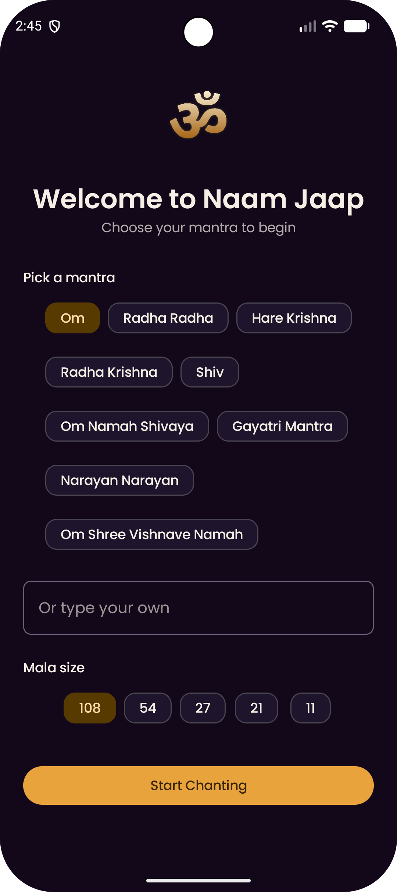
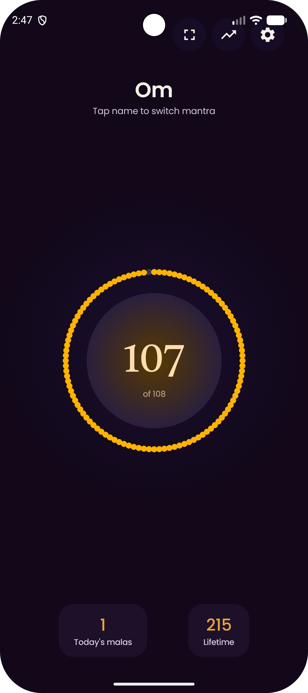
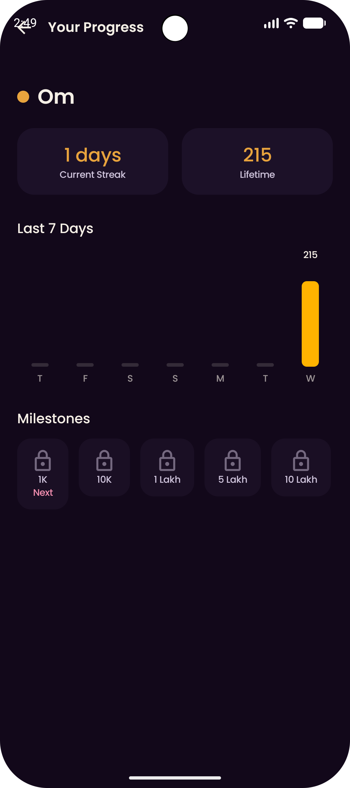

# 🕉️ Naam Jaap Sadhana

A free, offline-first digital japa mala (mantra chanting counter) app for Android — built with Kotlin and Jetpack Compose. No ads, no in-app purchases, no login, no analytics.


 
  <p align="center">
    
    
    
    
  </p>

## Features

- One-tap / swipe counting with a 108-bead progress ring
- Volume-button counting for eyes-closed chanting (toggleable)
- Multiple mantra profiles, each with its own mala size, accent color, and chanting history
- Focus Mode — full-screen, distraction-free chanting view with a gentle breathing glow
- Daily/weekly progress chart, streak tracking, and milestone badges
- Home-screen widget (Glance) with one-tap increment
- Daily reminder notification
- Local JSON backup/export and import — no cloud, no login required
- Light & Dark themes, adjustable haptics and sound
- System splash screen (Android 6.0+, via `androidx.core.splashscreen`)

## Tech Stack

| Layer | Technology |
|---|---|
| Language | Kotlin |
| UI | Jetpack Compose + Material 3 |
| Architecture | MVVM + Clean Architecture (presentation / domain / data) |
| DI | Hilt |
| Local storage | Room (structured data) + DataStore Preferences (settings) |
| Navigation | Navigation Compose |
| Background work | WorkManager (daily reminder) |
| Widget | Jetpack Glance, with a Preferences-backed fast-state cache for instant tap response |
| Async | Kotlin Coroutines + Flow |
| Serialization | kotlinx.serialization (backup/export) |
| Testing | JUnit + MockK + kotlinx-coroutines-test |

## Architecture

The app follows Clean Architecture with three layers:

```
presentation/   → Composable screens, ViewModels, UI state
domain/         → Models, repository interfaces, use cases (business logic)
data/           → Room entities/DAOs, DataStore, repository implementations
```

**Data flow:** UI events → ViewModel → UseCase → Repository (interface) → Repository (impl) → Room/DataStore.

Key decisions:
- **Optimistic UI updates** on tap — the counter updates instantly in the UI while the database write happens in the background, so chanting never feels laggy.
- **Widget performance:** the home-screen widget keeps its own small cached state (via Glance's `PreferencesGlanceStateDefinition`) instead of re-querying Room on every tap. Taps update the cache and redraw instantly; the real database write happens after, and the app resyncs the widget's cache whenever a count changes from inside the app.
- **Widget refresh is abstracted behind a `WidgetRefresher` interface** rather than calling Android/Glance framework classes directly from the ViewModel — keeps the ViewModel unit-testable without a real device.
- **Streak calculation reads from the daily-aggregates table** (populated on every tap) rather than the raw session-log table, since the latter is only populated via backup import — an early version of this app had a bug where streaks always showed 0 because of this exact mismatch.
- **No network permission** — the app is fully offline; backup/restore uses Android's Storage Access Framework instead of any server.

## Building & Running

### Prerequisites
- Android Studio (latest stable)
- JDK 11+

### Steps
1. Clone the repository and open it in Android Studio.
2. Let Gradle sync (dependencies are managed via the version catalog in `gradle/libs.versions.toml`).
3. Run on an emulator or device with **minSdk 26** or higher.

### Release builds
Release builds are signed and minified. To build a release yourself:

1. Create your own keystore (`Build → Generate Signed App Bundle/APK → Create new...`).
2. Create a `keystore.properties` file in the project root (never commit this file):
   ```properties
   RELEASE_STORE_FILE=C\:/path/to/your-release.jks
   RELEASE_STORE_PASSWORD=your_store_password
   RELEASE_KEY_ALIAS=your_key_alias
   RELEASE_KEY_PASSWORD=your_key_password
   ```
3. Run `./gradlew bundleRelease` (for Play Store) or `./gradlew assembleRelease` (for a standalone APK).

> **Note:** ProGuard/R8 rules for Room, Hilt, WorkManager, kotlinx.serialization, and the Glance widget's reflection-based `ActionCallback` are already included in `proguard-rules.pro`. If you add new reflection-based entry points (widgets, workers, receivers), remember to add matching `-keep` rules.

## Testing

Unit tests cover the domain (use case) and presentation (ViewModel) layers:

```
./gradlew testDebugUnitTest
```

Test report: `app/build/reports/tests/testDebugUnitTest/index.html`

Compose UI tests are planned for a future update.

## Status

Currently in **Google Play Closed Testing**. Core features are complete and stable; the app has gone through multiple test-driven fix cycles covering widget performance, streak-tracking accuracy, theming/contrast across light and dark mode, and edge-to-edge layout on Android 15+.

## Known Limitations / Roadmap

- **Deity image backgrounds in Focus Mode** — planned for v2 (gallery photo-picker + Coil for image loading).
- **Exact-time reminder reliability on some OEM skins** — if users report reminders not firing on time in the background, migrate from WorkManager to `AlarmManager` with `setExactAndAllowWhileIdle` (implementation notes kept internally).
- **Compose UI tests** — to be added in a subsequent update.
- **ASO refinement** — broader keyword coverage in the Play Store listing description, planned post-testing.

## Privacy

Naam Jaap Sadhana collects no personal data, requires no account, and makes no network requests. All data (mantras, counts, history, settings) stays on-device. See the in-app Privacy Policy for details.

